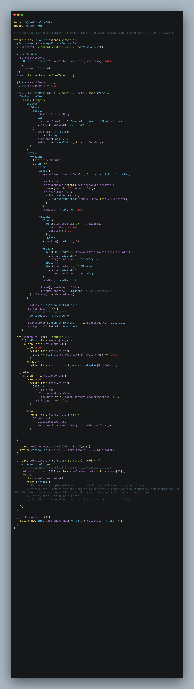

# TS-wift
Just playing around with TypeScript to make something swift like.

[orig](https://github.com/roman-luzgin/TodoAppSwiftUI3)
[codespace orig](https://jspears-roman-luzgin-todoappswiftui3-g67rfvx4.github.dev/)

